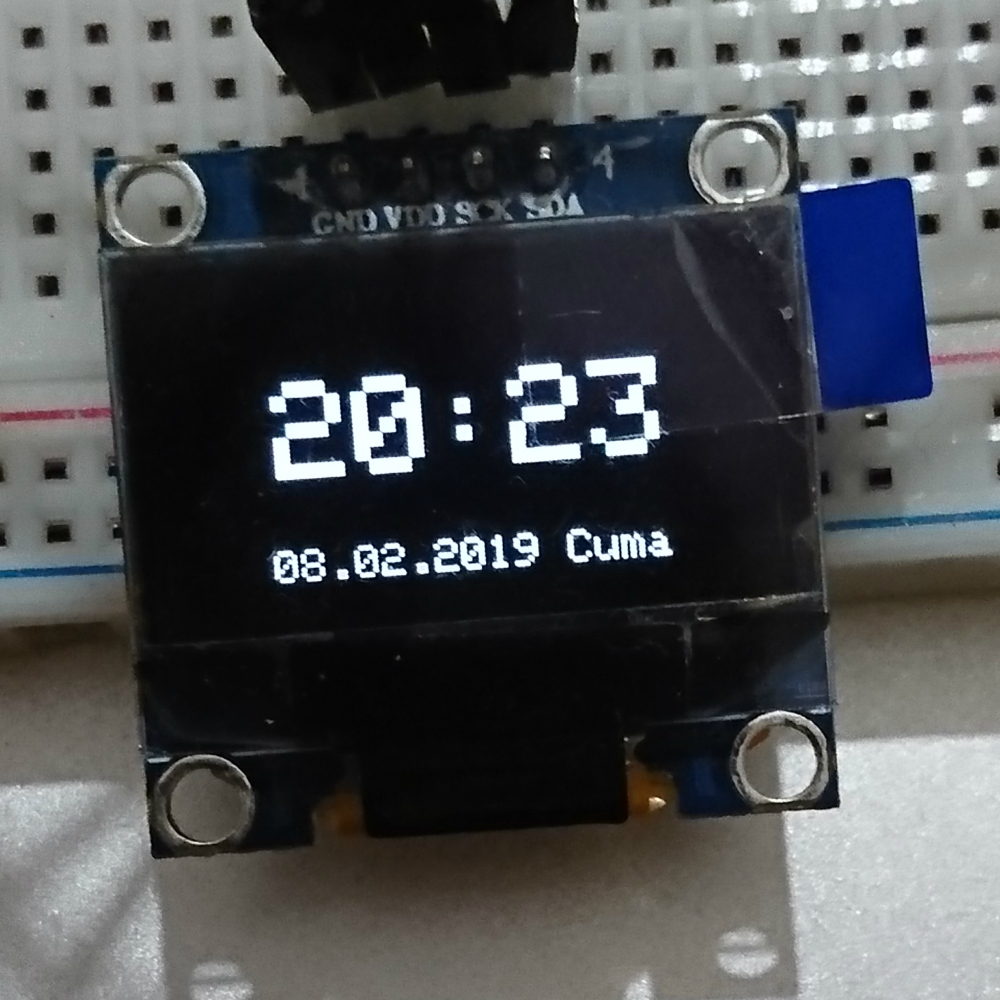
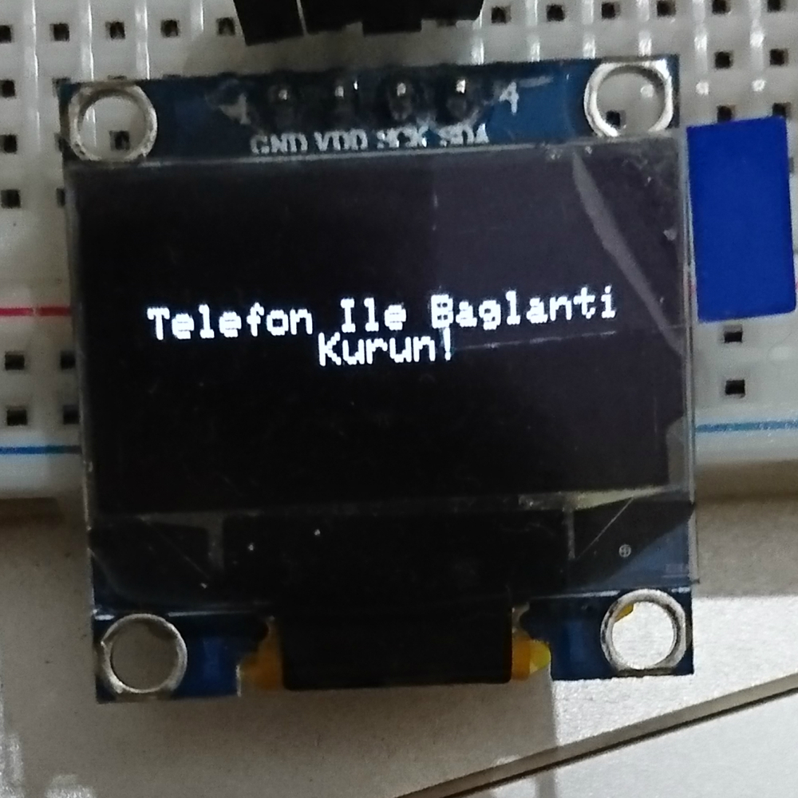
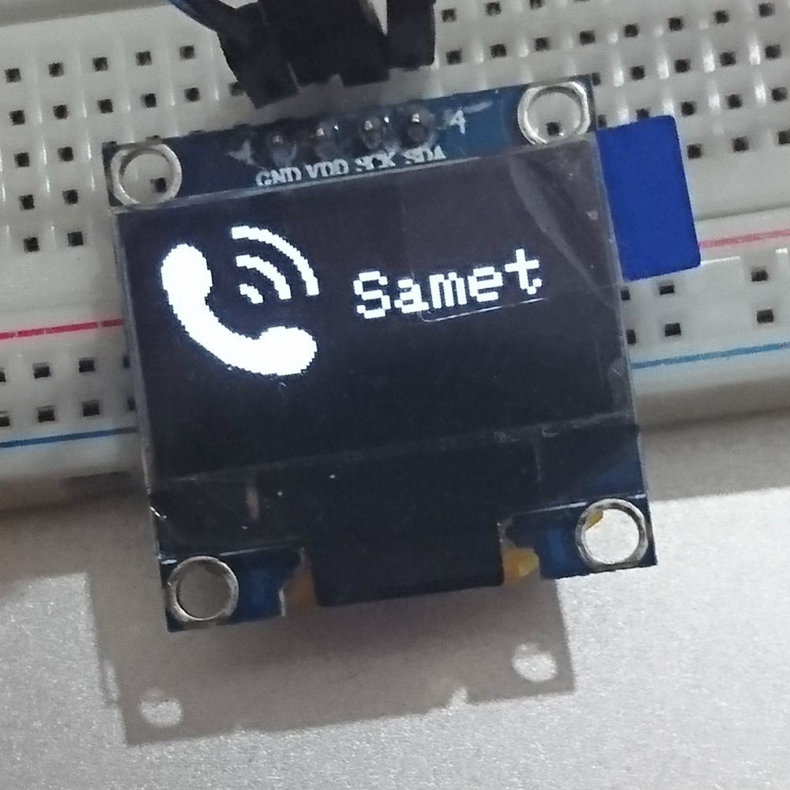
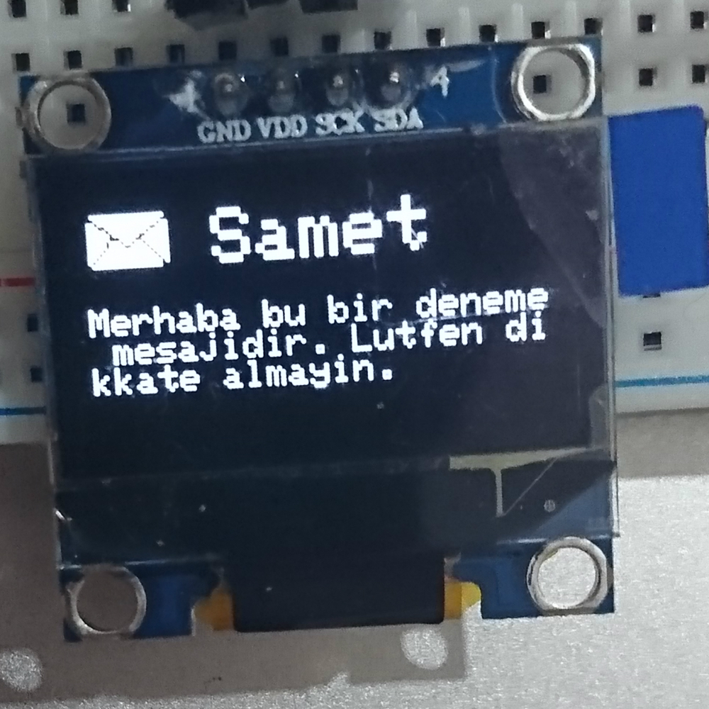

# Ar-Watch

Enhanced smart wristwatch with arduino working with Android phone. 
**Note: The clock parts are not joined.**

## Used materials
- Arduino Pro Mini
- HC-05 Bluetooth Module
- OLED I2c Display
- 450 Amps Lithium Polymer Battery

## Libraries Used for OLED I2c Display
- Adafruit_SSD1306-master [Adafruit_SSD1306-master](https://github.com/adafruit/Adafruit_SSD1306)
- Adafruit-GFX-Library-master [Adafruit-GFX-Library-master](https://github.com/adafruit/Adafruit-GFX-Library)

## How does the clock work?
- A bluetooth connection must be established from the Android application.
- Clock information must be sent from the Android application.
- The message and caller can be checked by opening and closing.

## Clock Images
&nbsp;&nbsp;&nbsp;&nbsp;&nbsp;&nbsp;&nbsp;&nbsp;
